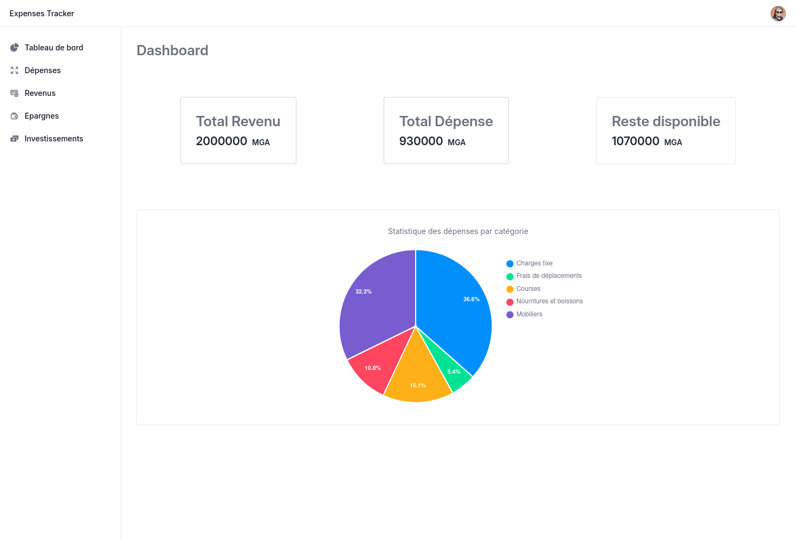

# Expense Tracker



Expense Tracker is a web application designed to help users track their income, expenses, and savings. The interface provides a clear and intuitive view to effectively manage finances.

## Features

- **Dashboard** : An overview of your finances.
- **Expenses** : Manage and track your detailed expenses.
- **Income** : Add and view your sources of income.
- **Savings** : Plan and track your savings.
- **Investments:**: Manage your investments.

## Technologies

- **Angular** : Main framework.
- **TypeScript** : Development language.
- **HTML & CSS** : Structure and styling.
- **Git** : Control verion.
- **GitHub Page** : Hosting.
- **Supabase** : For the backend and the database

## Installation

1. Clone the repository: :
   ```bash
   git clone https://github.com/gitmbints/expense-tracker.git
   ```
2. Navigate to the project folder: :
   ```bash
   cd expense-tracker
   ```
3. Install dependencies :
   ```bash
   npm install
   ```
4. Start the app :
   ```bash
   npm start
   ```
5. Open `http://localhost:4200` in your browser.

## Contributing

Contributions are welcome :

1. Fork the repository.
2. Create a branch (`git checkout -b feature/my-feature`).
3. Commit your changes (`git commit -m 'feat: my new feature'`).
4. Push the branch (`git push origin feature/my-feature`).
5. Open a Pull Request.

## Thank you for checking out this project!
